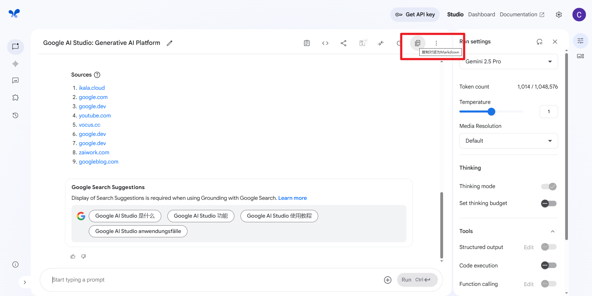
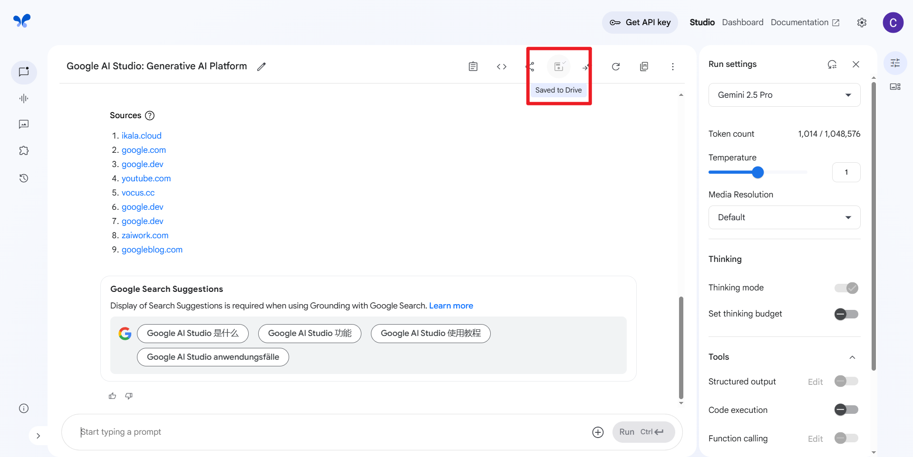
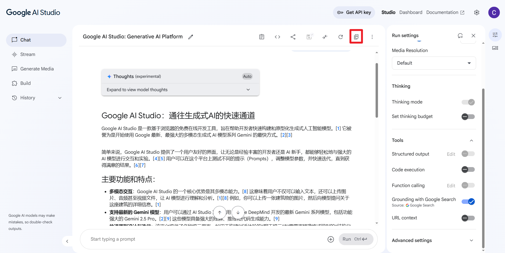
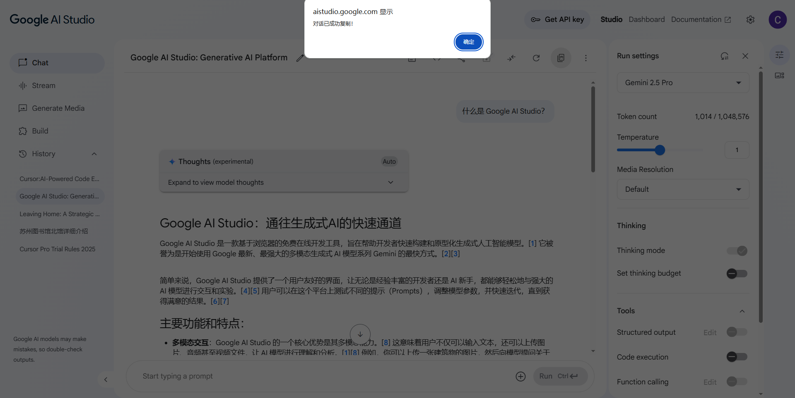
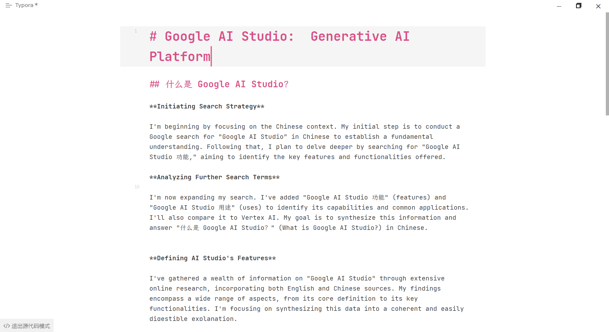

# Google AI Studio Markdown Copier Chrome 扩展

  

这是一个 Chrome 扩展程序，旨在简化从 Google AI Studio 导出对话内容的流程。

它会在 AI Studio 对话页面的工具栏中添加一个醒目的 **“复制对话为Markdown”** 按钮。点击该按钮后，扩展会自动捕获当前对话的完整历史记录，将其格式化为结构清晰的 **Markdown** 格式，并直接复制到用户的剪贴板中。

这对于需要将对话内容用于以下场景的用户非常方便：

*   保存和归档重要的对话记录。
*   在技术文档、博客文章或笔记中引用 AI 的回答。
*   与他人分享完整的交互过程。
*   将对话导入其他工具进行分析或处理。

##  :exclamation: 重要前提：启用自动保存

**请注意：** 为了确保本扩展能够正常工作，您 **必须** 在 Google AI Studio 的设置中启用 **“自动保存”（Autosave）** 功能。

本扩展依赖于 AI Studio 自动保存时触发的内部数据更新来捕获最完整的对话历史。如果未开启自动保存，扩展将无法获取实时对话内容，导致复制失败或内容不完整。

---

## ✨ 主要功能

*   **一键复制:** 在 Google AI Studio 对话页面的工具栏上添加一个易于操作的“复制对话为Markdown”按钮。
*   **结构化 Markdown:** 自动将对话转换为标准的 Markdown 格式：
    *   对话标题作为一级标题 (`#`)。
    *   用户的每个提示 (Prompt) 作为二级标题 (`##`)。
    *   模型的每个思考过程和最终回答作为正文，同时保证原有的 Markdown 格式。
    *   使用 `---` 分隔线区分不同的对话轮次。

---

## 🚀 安装方法 (开发者模式加载)

由于此扩展目前未在 Chrome Web Store 上架，您需要通过开发者模式手动加载：

1.  **获取项目文件：**
    *   如果您尚未拥有项目文件，请通过 `git clone` 或直接下载 ZIP 的方式从代码仓库获取所有文件。
    *   将所有文件保存在一个你方便找到的文件夹中 (例如 `google-ai-studio-markdown-copier`)。

2.  **在 Chrome 中加载扩展：**
    *   打开 Chrome 浏览器。
    *   在地址栏输入 `chrome://extensions` 并按回车键，进入扩展管理页面。
    *   **开启“开发者模式”：** 确保页面右上角的“开发者模式 (Developer mode)”开关已打开。
    *   **加载扩展：** 点击页面左上角出现的“加载已解压的扩展程序 (Load unpacked)”按钮。
    *   **选择文件夹：** 在弹出的文件选择窗口中，找到并选择你在第 1 步中**存放项目文件的那个根文件夹** (确保它包含了 `manifest.json`)。
    *   点击“选择文件夹 (Select Folder)”。

3.  **完成：**
    *   "Google AI Studio Markdown Copier" 扩展现在应该会出现在你的扩展列表中，并已默认启用。

---

## 💡 如何使用

1.  确保扩展已按照上述步骤成功安装并启用。
2.  打开任意一个 Google AI Studio 的对话页面 (例如 `https://aistudio.google.com/prompts/...`)。
3.  在页面顶部的工具栏中（靠近“保存”和“运行”按钮的位置），您应该能看到一个新增的 **Markdown 图标**。
4.  将鼠标悬停在该图标上，会显示提示：“复制对话为Markdown”。
5.  与模型对话，等待对话自动存储至 Google Drive。
6.  点击复制按钮。
7.  浏览器会弹窗提示“对话已成功复制！”。
8.  现在，Markdown 格式的对话内容已经在您的剪贴板里了。您可以将其粘贴到任何文本编辑器（如 Typora, VS Code）、笔记软件或需要使用该内容的地方。

---

## ⚠️ 已知问题与限制

*   **依赖 Google AI Studio 页面结构和API:** 本扩展强依赖于 Google AI Studio 网站当前的 HTML 结构、CSS 类名以及其内部网络请求的响应数据结构。如果 Google 未来进行大规模的网站改版，可能会导致选择器或数据解析逻辑失效，进而使扩展无法正常工作。届时需要更新代码。

---

## 🤝 贡献

如果您发现任何 Bug、有改进建议或想要添加新功能，欢迎通过以下方式贡献：

*   提交 **Issue** 报告问题或提出建议。
*   创建 **Pull Request** 提交您的代码更改。

---

## 📄 许可证

本项目根据 [MIT 许可证](LICENSE) 的条款进行许可。
