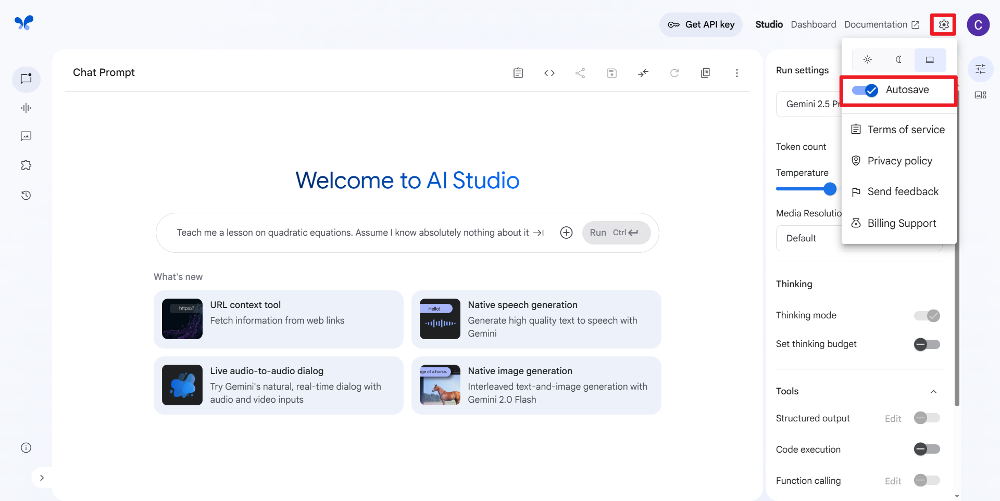

[English](./README.md)

# AI Studio Enhancer 浏览器扩展

AI Studio Enhancer 是一款旨在全面提升 Google AI Studio 使用体验的浏览器扩展，提供强大的对话管理和导航功能，主要适用场景有对话归档、内容引用、分享交互、数据分析、长对话导航、快速回顾。

## ✨ 主要功能

### 📋 Markdown 导出功能

*   **一键复制:** 在对话页面的工具栏上添加一个易于操作的"复制对话为 Markdown 格式"按钮。
*   **结构化 Markdown:** 自动将对话转换为标准的 Markdown 格式：
    *   对话标题作为一级标题 (`#`)。
    *   用户的每个提问作为二级标题 (`##`)。
    *   模型的每个思考过程和最终回答作为正文，同时保证原有的 Markdown 格式。
    *   使用 `---` 分隔线区分不同的对话轮次。

### 🧭 对话导航功能

*   **一键导航**: 在对话页面的工具栏上添加一个易于操作的"打开对话目录"按钮。
*   **智能目录:** 在右侧边栏显示对话目录，列出所有用户提问的预览。
*   **快速导航:** 自动识别对话中的用户提问，支持一键跳转：
    *   文本提示显示截断预览（50字符）。
    *   图片提问显示 `[Image]` 标识。
    *   文件及其他提问显示 `[File]` 标识。
    *   点击任意目录项快速跳转到对应位置。
*   **视觉反馈:** 导航时提供高亮效果，清楚标示目标位置。
*   **实时同步:** 对话变化时自动更新目录内容。
*   键盘导航: 增加可访问性：
    *   用户按 Tab 键可以在目录项之间导航。
    *   当某个目录项获得焦点时，会有视觉指示。
    *   按 Enter 或空格键可以跳转到对应的对话位置。

---

## 💡 如何使用

### :exclamation: 重要前提：启用自动保存

**请注意：** 为了确保本扩展能够正常工作，您 **必须** 在 Google AI Studio 的设置中启用 **"自动保存"（Autosave）** 功能。(本扩展依赖于 AI Studio 自动保存时触发的内部数据更新来捕获最完整的对话历史。如果未开启自动保存，扩展将无法获取实时对话内容，导致功能失效或内容不完整。)

### 📋 Markdown 导出

1.  与模型对话，等待对话自动存储至 Google Drive。
2.  点击工具栏中的 Markdown 图标。
3.  浏览器会弹窗提示"对话已成功复制！"。
4.  现在，Markdown 格式的对话内容已经在您的剪贴板里了。您可以将其粘贴到任何文本编辑器（如 Typora, VS Code）、笔记软件或需要使用该内容的地方。

---

### 🧭 对话导航

1.  点击工具栏中的列表图标打开对话目录。
2.  目录面板会在右侧滑出，显示所有用户提示的列表。
3.  点击任意目录项可以快速跳转到对话中的对应位置。
4.  跳转时会有蓝色高亮效果标示目标位置。
5.  再次点击列表图标或点击目录面板的关闭按钮可以关闭目录。

---

## 🚀 安装方法

此扩展目前未在插件商店上架，您需要通过开发者模式手动加载。

### 方法一：从 Release 安装（推荐）

1.  **下载 ZIP 包：**
    *   访问本项目的 [Releases 页面](https://github.com/chenx2code/ai-studio-enhancer/releases)。
    *   找到最新的版本，点击下载名为 `ai-studio-enhancer-vX.X.X.zip` 的文件。

2.  **解压文件：**
    *   将下载的 `.zip` 文件解压到一个你方便找到的永久文件夹中。

3.  **在 Chrome 中加载扩展：**
    *   打开 Chrome 浏览器。
    *   在地址栏输入 `chrome://extensions` 并按回车键，进入扩展管理页面。
    *   **开启"开发者模式"：** 确保页面右上角的"开发者模式 (Developer mode)"开关已打开。
    *   **加载扩展：** 点击页面左上角出现的"加载已解压的扩展程序 (Load unpacked)"按钮。
    *   **选择文件夹：** 在弹出的文件选择窗口中，选择你在上一步**解压出来的那个文件夹** (确保它包含了 `manifest.json`)。
    *   点击"选择文件夹 (Select Folder)"。

4.  **完成：**
    *   "AI Studio Enhancer" 扩展现在应该会出现在你的扩展列表中，并已默认启用。

### 方法二：从源代码加载（开发者）

此方法适用于希望获取最新代码或进行二次开发的开发者。

1.  **获取项目文件：**
    *   通过 `git clone https://github.com/chenx2code/ai-studio-enhancer.git` 克隆本仓库。
    *   将所有文件保存在一个你方便找到的文件夹中。

2.  **加载扩展：**
    *   按照"方法一"中的第 3 步和第 4 步，在 Chrome 中加载包含源代码的根文件夹。

---

## ⚠️ 已知问题与限制

*   **依赖 Google AI Studio 页面结构和API:** 本扩展强依赖于 Google AI Studio 网站当前的 HTML 结构、CSS 类名以及其内部网络请求的响应数据结构。如果 Google 未来进行大规模的网站改版，可能会导致选择器或数据解析逻辑失效，进而使扩展无法正常工作。届时需要更新代码。

---

## 🤝 贡献

如果您发现任何 Bug、有改进建议或想要添加新功能，欢迎通过以下方式贡献：

*   提交 **Issue** 报告问题或提出建议。
*   创建 **Pull Request** 提交您的代码更改。

---

## 📄 许可证

本项目根据 [MIT 许可证](LICENSE) 的条款进行许可。

